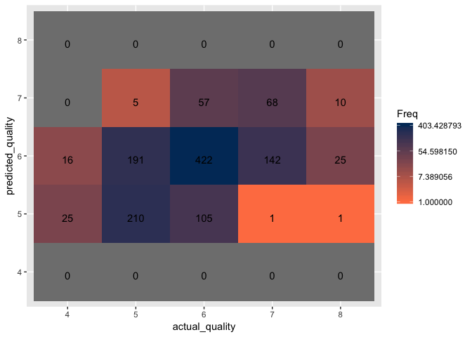

Wine Quality Classification using Neural Networks
================

Step 1: Load Libraries and read in the Data
===========================================

``` r
library(ggplot2)
library(tidyverse)
library(neuralnet)
```

``` r
white_wine <- read.csv("winequality-white.csv", sep = ";")

red_wine <- read.csv("winequality-red.csv", sep = ";")
```

Step 2: Inspect and prepare the data
====================================

``` r
str(white_wine)
```

    ## 'data.frame':    4898 obs. of  12 variables:
    ##  $ fixed.acidity       : num  7 6.3 8.1 7.2 7.2 8.1 6.2 7 6.3 8.1 ...
    ##  $ volatile.acidity    : num  0.27 0.3 0.28 0.23 0.23 0.28 0.32 0.27 0.3 0.22 ...
    ##  $ citric.acid         : num  0.36 0.34 0.4 0.32 0.32 0.4 0.16 0.36 0.34 0.43 ...
    ##  $ residual.sugar      : num  20.7 1.6 6.9 8.5 8.5 6.9 7 20.7 1.6 1.5 ...
    ##  $ chlorides           : num  0.045 0.049 0.05 0.058 0.058 0.05 0.045 0.045 0.049 0.044 ...
    ##  $ free.sulfur.dioxide : num  45 14 30 47 47 30 30 45 14 28 ...
    ##  $ total.sulfur.dioxide: num  170 132 97 186 186 97 136 170 132 129 ...
    ##  $ density             : num  1.001 0.994 0.995 0.996 0.996 ...
    ##  $ pH                  : num  3 3.3 3.26 3.19 3.19 3.26 3.18 3 3.3 3.22 ...
    ##  $ sulphates           : num  0.45 0.49 0.44 0.4 0.4 0.44 0.47 0.45 0.49 0.45 ...
    ##  $ alcohol             : num  8.8 9.5 10.1 9.9 9.9 10.1 9.6 8.8 9.5 11 ...
    ##  $ quality             : int  6 6 6 6 6 6 6 6 6 6 ...

``` r
str(red_wine)
```

    ## 'data.frame':    1599 obs. of  12 variables:
    ##  $ fixed.acidity       : num  7.4 7.8 7.8 11.2 7.4 7.4 7.9 7.3 7.8 7.5 ...
    ##  $ volatile.acidity    : num  0.7 0.88 0.76 0.28 0.7 0.66 0.6 0.65 0.58 0.5 ...
    ##  $ citric.acid         : num  0 0 0.04 0.56 0 0 0.06 0 0.02 0.36 ...
    ##  $ residual.sugar      : num  1.9 2.6 2.3 1.9 1.9 1.8 1.6 1.2 2 6.1 ...
    ##  $ chlorides           : num  0.076 0.098 0.092 0.075 0.076 0.075 0.069 0.065 0.073 0.071 ...
    ##  $ free.sulfur.dioxide : num  11 25 15 17 11 13 15 15 9 17 ...
    ##  $ total.sulfur.dioxide: num  34 67 54 60 34 40 59 21 18 102 ...
    ##  $ density             : num  0.998 0.997 0.997 0.998 0.998 ...
    ##  $ pH                  : num  3.51 3.2 3.26 3.16 3.51 3.51 3.3 3.39 3.36 3.35 ...
    ##  $ sulphates           : num  0.56 0.68 0.65 0.58 0.56 0.56 0.46 0.47 0.57 0.8 ...
    ##  $ alcohol             : num  9.4 9.8 9.8 9.8 9.4 9.4 9.4 10 9.5 10.5 ...
    ##  $ quality             : int  5 5 5 6 5 5 5 7 7 5 ...

#### Combine both red and white wine datasets

``` r
wine_data <- rbind(white_wine, red_wine)
```

#### Summary of the data

``` r
summary(wine_data)
```

    ##  fixed.acidity    volatile.acidity  citric.acid     residual.sugar  
    ##  Min.   : 3.800   Min.   :0.0800   Min.   :0.0000   Min.   : 0.600  
    ##  1st Qu.: 6.400   1st Qu.:0.2300   1st Qu.:0.2500   1st Qu.: 1.800  
    ##  Median : 7.000   Median :0.2900   Median :0.3100   Median : 3.000  
    ##  Mean   : 7.215   Mean   :0.3397   Mean   :0.3186   Mean   : 5.443  
    ##  3rd Qu.: 7.700   3rd Qu.:0.4000   3rd Qu.:0.3900   3rd Qu.: 8.100  
    ##  Max.   :15.900   Max.   :1.5800   Max.   :1.6600   Max.   :65.800  
    ##    chlorides       free.sulfur.dioxide total.sulfur.dioxide
    ##  Min.   :0.00900   Min.   :  1.00      Min.   :  6.0       
    ##  1st Qu.:0.03800   1st Qu.: 17.00      1st Qu.: 77.0       
    ##  Median :0.04700   Median : 29.00      Median :118.0       
    ##  Mean   :0.05603   Mean   : 30.53      Mean   :115.7       
    ##  3rd Qu.:0.06500   3rd Qu.: 41.00      3rd Qu.:156.0       
    ##  Max.   :0.61100   Max.   :289.00      Max.   :440.0       
    ##     density             pH          sulphates         alcohol     
    ##  Min.   :0.9871   Min.   :2.720   Min.   :0.2200   Min.   : 8.00  
    ##  1st Qu.:0.9923   1st Qu.:3.110   1st Qu.:0.4300   1st Qu.: 9.50  
    ##  Median :0.9949   Median :3.210   Median :0.5100   Median :10.30  
    ##  Mean   :0.9947   Mean   :3.219   Mean   :0.5313   Mean   :10.49  
    ##  3rd Qu.:0.9970   3rd Qu.:3.320   3rd Qu.:0.6000   3rd Qu.:11.30  
    ##  Max.   :1.0390   Max.   :4.010   Max.   :2.0000   Max.   :14.90  
    ##     quality     
    ##  Min.   :3.000  
    ##  1st Qu.:5.000  
    ##  Median :6.000  
    ##  Mean   :5.818  
    ##  3rd Qu.:6.000  
    ##  Max.   :9.000

#### Check for NA values in the data

``` r
anyNA(wine_data)
```

    ## [1] FALSE

#### There are no missing values in the data

#### Plot each variable against "quality" in a matrix to visualize the data

``` r
wine_data %>%
  gather(-quality, key = "variables", value = "value") %>%
  ggplot(aes(x = value, y = quality, color = variables)) +
  geom_point(alpha = 1/4) +
  facet_wrap(~ variables, scales = "free") + 
  scale_fill_brewer(palette = "Set3", 
                    name = "variables") 
```


#### Based on the above visualization of the data, there does not appear to be any variable that correlates with quality

#### Visualize the data to see the distribution of the various wine qualities

``` r
wine_data$quality %>% table() %>% 
  as.data.frame() %>% 
  ggplot(aes(x = ., y = Freq)) + 
  geom_bar(stat = "identity")
```


#### Based on the visualization above, the vast majority of wine qualities are labeled as 6 and 5

#### Get the table counts for the number of observations for each quality of wine

``` r
# Get a count of each wine quality observed
wine_data$quality %>% table()
```

    ## .
    ##    3    4    5    6    7    8    9 
    ##   30  216 2138 2836 1079  193    5

#### Based on the table above, wine qualities of three and nine only make up 0.54% of all the observations. Because of this, it may be better to filter out these observations as the model will not have sufficient data to train on in order to accurately classify them. Therefore, the project will focus on classifying wine qualities ranging from four to eight

#### Filter out any observations with wine qualities of three or nine

``` r
wine_data <- wine_data %>% 
  filter(quality > 3 & quality < 9)

# Check to make sure observations were removed
unique(wine_data$quality)
```

    ## [1] 6 5 7 8 4

#### Normalize the data

``` r
# Function to normalize the data
normalize <- function(x) {
    return((x - min(x)) / (max(x) - min(x)))
}

# Remove rownames from the dataframe
row.names(wine_data) <- c()

wine_data_norm <- data.frame(lapply(wine_data, normalize))

# Check data to make sure variables were normalized 
str(wine_data_norm)
```

    ## 'data.frame':    6462 obs. of  12 variables:
    ##  $ fixed.acidity       : num  0.264 0.207 0.355 0.281 0.281 ...
    ##  $ volatile.acidity    : num  0.152 0.176 0.16 0.12 0.12 0.16 0.192 0.152 0.176 0.112 ...
    ##  $ citric.acid         : num  0.217 0.205 0.241 0.193 0.193 ...
    ##  $ residual.sugar      : num  0.3083 0.0153 0.0966 0.1212 0.1212 ...
    ##  $ chlorides           : num  0.0598 0.0664 0.0681 0.0814 0.0814 ...
    ##  $ free.sulfur.dioxide : num  0.32 0.0945 0.2109 0.3345 0.3345 ...
    ##  $ total.sulfur.dioxide: num  0.485 0.373 0.269 0.533 0.533 ...
    ##  $ density             : num  0.268 0.133 0.154 0.164 0.164 ...
    ##  $ pH                  : num  0.217 0.45 0.419 0.364 0.364 ...
    ##  $ sulphates           : num  0.129 0.152 0.124 0.101 0.101 ...
    ##  $ alcohol             : num  0.116 0.217 0.304 0.275 0.275 ...
    ##  $ quality             : num  0.5 0.5 0.5 0.5 0.5 0.5 0.5 0.5 0.5 0.5 ...

``` r
unique(wine_data_norm$quality)
```

    ## [1] 0.50 0.25 0.75 1.00 0.00

#### Split the data into training, validation, and test datasets

``` r
# Set seed for duplication purposes
set.seed(123)

# Randomly sample and split the data
ss <- sample(1:3, 
             size=nrow(wine_data_norm), 
             replace=TRUE, 
             prob=c(0.6,0.2,0.2))

train <- wine_data[ss==1,]
validation <- wine_data[ss==2,]
test <- wine_data[ss==3,]

# Datasets with normalized observations
train_norm <- wine_data_norm[ss==1,] 
validation_norm <- wine_data_norm[ss==2,]
test_norm <- wine_data_norm[ss==3,]
```

Step 3: Train the nueral net model
==================================

#### Begin training the ANN model using a simple multilayer feedforward network with only a single hidden node. By default, the activation function used is logistic

``` r
set.seed(123)

simple_ann_classifier <- neuralnet(quality ~., 
                                   data = train_norm)
```

#### Plot the network topology

``` r
plot(simple_ann_classifier,
     rep = "best", 
     information = F)
```


#### Obtain the performance of the model by predicting on the validation dataset

``` r
# The compute() function works slightly differently from the predict() functions we've used so far. It returns a list with two components: $neurons, which stores the neurons for each layer in the network, and $net.result, which stores the predicted values. 
simple_ann_results <- compute(simple_ann_classifier, 
                              validation_norm[1:11])
```

#### Function to convert each predicted value to its respected quality value

``` r
round_predictions <- function(x) {
  if(x >= 0 & x <= 0.125) {
    x = 4
  } else if (x > 0.125 & x <= 0.375) {
    x = 5
  } else if (x > 0.375 & x <= 0.625) {
    x = 6
  } else if (x > 0.625 & x <= 0.875) {
    x = 7
  } else if (x > 0.875 & x <= 1) {
    x = 8
  } else if (x < 0) { # Sometimes the model may output negative values, in this case set it equal to a quality of 4
    x = 4
  } else if (x > 1.0) { # Sometimes the model may output values greater than 1, in this case set it equal to a quality of 8
    x = 8
  }
}
```

#### Convert and store the predictions

``` r
# Store the predicted values
predicted_quality <- sapply(simple_ann_results$net.result, 
                            round_predictions)
```

#### Obtain the accuracy between predicted and actual quality

``` r
# Accuracy of the model 
mean(predicted_quality == validation$quality)
```

    ## [1] 0.5312989

#### The simple ANN model results in an accuracy of 53.1%

#### Create a confusion matrix to visualize the classification accuracy

``` r
validation_results <- data.frame(cbind(validation$quality, predicted_quality))

# Change the column names of the table
names(validation_results) <- c("actual_quality", "predicted_quality")
# Remove rownames
rownames(validation_results) <- c()

# Convert predicted and actual results from numerical to factors 
validation_results$actual_quality <- factor(validation_results$actual_quality, levels = c("4", "5", "6", "7", "8")) 
validation_results$predicted_quality <- factor(validation_results$predicted_quality, levels = c("4", "5", "6", "7", "8"))

confusion_matrix <- as.data.frame(table(validation_results$actual_quality, validation_results$predicted_quality))

confusion_matrix <- validation_results %>% 
  table() %>% 
  as.data.frame()

ggplot(data = confusion_matrix,
       mapping = aes(x = actual_quality,
                     y = predicted_quality)) +
  geom_tile(aes(fill = Freq)) +
  geom_text(aes(label = sprintf("%1.0f", Freq)), vjust = 1) +
  scale_fill_gradient(low = "#ff7f50",
                      high = "#003767",
                      trans = "log")
```


#### To improve the performance of the neural network, hidden layers can be implemented in the model. However, adding too many hidden layers that exceed the sufficient amount necessary results in overfitting the model to the training data. This in turn results in poor generalization of unseen data and low classification accuracy. Ideally, its useful to begin with only adding 5 hidden layers.

``` r
ann_classifier <- neuralnet(quality ~., 
                            data = train_norm, 
                            hidden = 5)
```

#### Plot the network topology

``` r
plot(ann_classifier, 
     rep = "best", 
     information = F)
```


#### Obtain the performance of the model by predicting on the validation dataset

``` r
# The compute() function works a bit differently from the predict() functions we've used so far. It returns a list with two components: $neurons, which stores the neurons for each layer in the network, and $net.result, which stores the predicted values. 
ann_results <- compute(ann_classifier, 
                       validation_norm[1:11])

# Store the predicted values
predicted_quality <- sapply(ann_results$net.result, round_predictions)
```

#### Obtain the accuracy of the updated neural net model

``` r
# Accuracy of the model 
mean(predicted_quality == validation$quality)
```

    ## [1] 0.5586854

#### The updated model with 5 five hidden nodes resulted in 55.9%, an increase of 2.8%

#### Create a confusion matrix to visualize the classification accuracy

``` r
validation_results <- data.frame(cbind(validation$quality, predicted_quality))

# Change the column names of the table
names(validation_results) <- c("actual_quality", "predicted_quality")
# Remove rownames
rownames(validation_results) <- c()

# Convert predicted and actual results from numerical to factors 
validation_results$actual_quality <- factor(validation_results$actual_quality, levels = c("4", "5", "6", "7", "8")) 
validation_results$predicted_quality <- factor(validation_results$predicted_quality, levels = c("4", "5", "6", "7", "8"))

confusion_matrix <- as.data.frame(table(validation_results$actual_quality, validation_results$predicted_quality))

confusion_matrix <- validation_results %>% 
  table() %>% 
  as.data.frame()

ggplot(data = confusion_matrix,
       mapping = aes(x = actual_quality,
                     y = predicted_quality)) +
  geom_tile(aes(fill = Freq)) +
  geom_text(aes(label = sprintf("%1.0f", Freq)), vjust = 1) +
  scale_fill_gradient(low = "#ff7f50",
                      high = "#003767",
                      trans = "log")
```


#### Aside from adding hidden nodes, different activation functions can be applied. The activation function transforms a neuron's combined input signals into a single output signal to be broadcasted further in the network. By default, the neuralnet package uses the logistic function, however, a variety functions can be used such as the tanh function

``` r
# ANN model with 3 hidden nodes and a tanh activation function
tanh_ann_classifier <- neuralnet(quality ~., 
                                 data = train_norm, 
                                 hidden = 4, 
                                 act.fct = "tanh")

plot(tanh_ann_classifier, 
     rep = "best", 
     information = F)
```


#### Obtain the performance of the model by predicting on the validation dataset

``` r
# The compute() function works a bit differently from the predict() functions we've used so far. It returns a list with two components: $neurons, which stores the neurons for each layer in the network, and $net.result, which stores the predicted values. 
tanh_ann_results <- compute(tanh_ann_classifier, 
                            validation_norm[1:11])

# Store the predicted values
predicted_quality <- sapply(tanh_ann_results$net.result, round_predictions)

# Accuracy of the model 
mean(predicted_quality == validation$quality)
```

    ## [1] 0.5532081

#### Using the tanh activation function, the model does not converge with 5 hidden nodes. After reducing the number of nodes to 4, the model converges and results in 55.3% accuracy, a slight decrease of 0.6% from the model with the logistic activation function and 5 hidden layers

#### Create a confusion matrix to visualize the classification accuracy

``` r
validation_results <- data.frame(cbind(validation$quality, predicted_quality))

# Change the column names of the table
names(validation_results) <- c("actual_quality", "predicted_quality")
# Remove rownames
rownames(validation_results) <- c()

# Convert predicted and actual results from numerical to factors 
validation_results$actual_quality <- factor(validation_results$actual_quality, levels = c("4", "5", "6", "7", "8")) 
validation_results$predicted_quality <- factor(validation_results$predicted_quality, levels = c("4", "5", "6", "7", "8"))

confusion_matrix <- as.data.frame(table(validation_results$actual_quality, validation_results$predicted_quality))

confusion_matrix <- validation_results %>% 
  table() %>% 
  as.data.frame()

ggplot(data = confusion_matrix,
       mapping = aes(x = actual_quality,
                     y = predicted_quality)) +
  geom_tile(aes(fill = Freq)) +
  geom_text(aes(label = sprintf("%1.0f", Freq)), vjust = 1) +
  scale_fill_gradient(low = "#ff7f50",
                      high = "#003767",
                      trans = "log")
```


#### Custom activation functions can also be created

``` r
# Custom activation function
softplus <- function(x) log(1 + exp(x))

# ANN model with 5 hidden nodes and a softplus activation function
softplus_ann_classifier <- neuralnet(quality ~., 
                                     data = train_norm,
                                     hidden = 4, 
                                     act.fct = softplus)

plot(softplus_ann_classifier, 
     rep = "best", 
     information = F)
```


#### Obtain the performance of the model by predicting on the validation dataset

``` r
# The compute() function works a bit differently from the predict() functions we've used so far. It returns a list with two components: $neurons, which stores the neurons for each layer in the network, and $net.result, which stores the predicted values. 
softplus_ann_results <- compute(softplus_ann_classifier, 
                                validation_norm[1:11])

# Store the predicted values
predicted_quality <- sapply(softplus_ann_results$net.result, round_predictions)

# Accuracy of the model 
mean(predicted_quality == validation$quality)
```

    ## [1] 0.5367762

#### Using the custom softplus activation function with 4 hidden nodes results in 53.7% accuracy, a decrease of 2.2% from the model with the logistic activation function and 5 hidden layers

#### Create a confusion matrix to visualize the classification accuracy

``` r
validation_results <- data.frame(cbind(validation$quality, predicted_quality))

# Change the column names of the table
names(validation_results) <- c("actual_quality", "predicted_quality")
# Remove rownames
rownames(validation_results) <- c()

# Convert predicted and actual results from numerical to factors 
validation_results$actual_quality <- factor(validation_results$actual_quality, levels = c("4", "5", "6", "7", "8")) 
validation_results$predicted_quality <- factor(validation_results$predicted_quality, levels = c("4", "5", "6", "7", "8"))

confusion_matrix <- as.data.frame(table(validation_results$actual_quality, validation_results$predicted_quality))

confusion_matrix <- validation_results %>% 
  table() %>% 
  as.data.frame()

ggplot(data = confusion_matrix,
       mapping = aes(x = actual_quality,
                     y = predicted_quality)) +
  geom_tile(aes(fill = Freq)) +
  geom_text(aes(label = sprintf("%1.0f", Freq)), vjust = 1) +
  scale_fill_gradient(low = "#ff7f50",
                      high = "#003767",
                      trans = "log")
```


#### Custom activation functions can be created

``` r
# Custom activation function
arctan <- function(x) atan(x)

# ANN model with 5 hidden nodes and a softplus activation function
arctan_ann_classifier <- neuralnet(quality ~., 
                                   data = train_norm, 
                                   hidden = 3, 
                                   act.fct = arctan)

plot(arctan_ann_classifier, 
     rep = "best", 
     information = F)
```


#### Obtain the performance of the model by predicting on the validation dataset

``` r
# The compute() function works a bit differently from the predict() functions we've used so far. It returns a list with two components: $neurons, which stores the neurons for each layer in the network, and $net.result, which stores the predicted values. 
arctan_ann_results <- compute(arctan_ann_classifier, 
                              validation_norm[1:11])

# Store the predicted values
predicted_quality <- sapply(arctan_ann_results$net.result, round_predictions)

# Accuracy of the model 
mean(predicted_quality == validation$quality)
```

    ## [1] 0.5477308

#### Using the custom arctan activation function with 3 hidden nodes results in 54.8% accuracy, a decrease of 1.1% from the model with the logistic activation function and 5 hidden layers

#### Create a confusion matrix to visualize the classification accuracy

``` r
validation_results <- data.frame(cbind(validation$quality, predicted_quality))

# Change the column names of the table
names(validation_results) <- c("actual_quality", "predicted_quality")
# Remove rownames
rownames(validation_results) <- c()

# Convert predicted and actual results from numerical to factors 
validation_results$actual_quality <- factor(validation_results$actual_quality, levels = c("4", "5", "6", "7", "8")) 
validation_results$predicted_quality <- factor(validation_results$predicted_quality, levels = c("4", "5", "6", "7", "8"))

confusion_matrix <- as.data.frame(table(validation_results$actual_quality, validation_results$predicted_quality))

confusion_matrix <- validation_results %>% 
  table() %>% 
  as.data.frame()

ggplot(data = confusion_matrix,
       mapping = aes(x = actual_quality,
                     y = predicted_quality)) +
  geom_tile(aes(fill = Freq)) +
  geom_text(aes(label = sprintf("%1.0f", Freq)), vjust = 1) +
  scale_fill_gradient(low = "#ff7f50",
                      high = "#003767",
                      trans = "log")
```



Step 5: Apply the best performing model to the test dataset
===========================================================

#### Out of all five neural network models trained, the model with the highest classification accuracy resulted from the ann model with a logistic activation function (by default) and five hidden layers with a classification accuracy of 55.9%. This is a substantially low classification accuracy and could be a result of the data being non-informative about the quality of wine, neural network models not being the most effective method for classification or a combination of the two.

``` r
# ann_classifier <- neuralnet(quality ~., 
#                             data = train_norm, 
#                             hidden = 5)

# Obtain the performance of the model by predicting on the test dataset

# The compute() function works a bit differently from the predict() functions we've used so far. It returns a list with two components: $neurons, which stores the neurons for each layer in the network, and $net.result, which stores the predicted values.
test_ann_results <- compute(ann_classifier,
                            test_norm[1:11])

# Store the predicted values
predicted_quality <- sapply(test_ann_results$net.result, round_predictions)

# Obtain the accuracy of the updated neural net model 

# Accuracy of the model
mean(predicted_quality == test$quality)
```

    ## [1] 0.5382813

``` r
# The updated model with 5 five hidden nodes resulted in 55.9%, an increase of 2.8%

# Create a confusion matrix to visualize the classification accuracy
test_results <- data.frame(cbind(test$quality, predicted_quality))

# Change the column names of the table
names(test_results) <- c("actual_quality", "predicted_quality")
# Remove rownames
rownames(test_results) <- c()

# Convert predicted and actual results from numerical to factors
test_results$actual_quality <- factor(test_results$actual_quality, levels = c("4", "5", "6", "7", "8"))
test_results$predicted_quality <- factor(test_results$predicted_quality, levels = c("4", "5", "6", "7", "8"))

confusion_matrix <- as.data.frame(table(test_results$actual_quality, test_results$predicted_quality))

confusion_matrix <- test_results %>%
  table() %>%
  as.data.frame()

ggplot(data = confusion_matrix,
       mapping = aes(x = actual_quality,
                     y = predicted_quality)) +
  geom_tile(aes(fill = Freq)) +
  geom_text(aes(label = sprintf("%1.0f", Freq)), vjust = 1) +
  scale_fill_gradient(low = "#ff7f50",
                      high = "#003767",
                      trans = "log")
```


#### Upon examining the visualization of the confusion matrix, it is clear that model struggled at classifying of five qualities of wines with the highest classification accuracy rate of 68.2% for quality six wines. The model struggles to classify all other qualities of wine with all others having an accuracy rate below 63%. As mentioned before, this could be most likely due to the data being non-informative on top of the fact that most observations are quality six and seven wines
