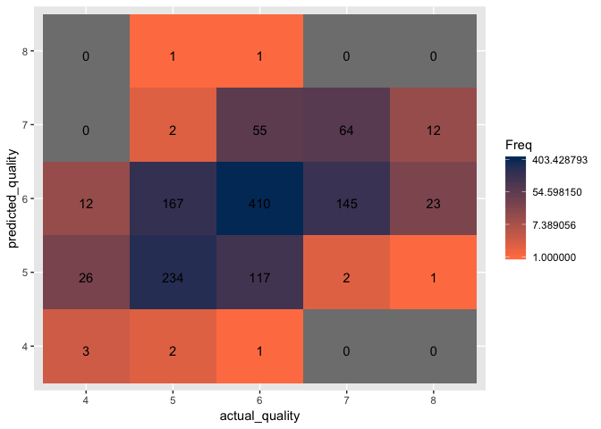

Wine Quality Classification using Support Vector Machine algorithms
================

Step 1: Load Libraries and read in the Data
===========================================

``` r
library(ggplot2)
library(tidyverse)
library(kernlab)
library(e1071)
library(caret)
```

``` r
white_wine <- read.csv("winequality-white.csv", sep = ";")

red_wine <- read.csv("winequality-red.csv", sep = ";")
```

Step 2: Inspect and prepare the data
====================================

``` r
str(white_wine)
```

    ## 'data.frame':    4898 obs. of  12 variables:
    ##  $ fixed.acidity       : num  7 6.3 8.1 7.2 7.2 8.1 6.2 7 6.3 8.1 ...
    ##  $ volatile.acidity    : num  0.27 0.3 0.28 0.23 0.23 0.28 0.32 0.27 0.3 0.22 ...
    ##  $ citric.acid         : num  0.36 0.34 0.4 0.32 0.32 0.4 0.16 0.36 0.34 0.43 ...
    ##  $ residual.sugar      : num  20.7 1.6 6.9 8.5 8.5 6.9 7 20.7 1.6 1.5 ...
    ##  $ chlorides           : num  0.045 0.049 0.05 0.058 0.058 0.05 0.045 0.045 0.049 0.044 ...
    ##  $ free.sulfur.dioxide : num  45 14 30 47 47 30 30 45 14 28 ...
    ##  $ total.sulfur.dioxide: num  170 132 97 186 186 97 136 170 132 129 ...
    ##  $ density             : num  1.001 0.994 0.995 0.996 0.996 ...
    ##  $ pH                  : num  3 3.3 3.26 3.19 3.19 3.26 3.18 3 3.3 3.22 ...
    ##  $ sulphates           : num  0.45 0.49 0.44 0.4 0.4 0.44 0.47 0.45 0.49 0.45 ...
    ##  $ alcohol             : num  8.8 9.5 10.1 9.9 9.9 10.1 9.6 8.8 9.5 11 ...
    ##  $ quality             : int  6 6 6 6 6 6 6 6 6 6 ...

``` r
str(red_wine)
```

    ## 'data.frame':    1599 obs. of  12 variables:
    ##  $ fixed.acidity       : num  7.4 7.8 7.8 11.2 7.4 7.4 7.9 7.3 7.8 7.5 ...
    ##  $ volatile.acidity    : num  0.7 0.88 0.76 0.28 0.7 0.66 0.6 0.65 0.58 0.5 ...
    ##  $ citric.acid         : num  0 0 0.04 0.56 0 0 0.06 0 0.02 0.36 ...
    ##  $ residual.sugar      : num  1.9 2.6 2.3 1.9 1.9 1.8 1.6 1.2 2 6.1 ...
    ##  $ chlorides           : num  0.076 0.098 0.092 0.075 0.076 0.075 0.069 0.065 0.073 0.071 ...
    ##  $ free.sulfur.dioxide : num  11 25 15 17 11 13 15 15 9 17 ...
    ##  $ total.sulfur.dioxide: num  34 67 54 60 34 40 59 21 18 102 ...
    ##  $ density             : num  0.998 0.997 0.997 0.998 0.998 ...
    ##  $ pH                  : num  3.51 3.2 3.26 3.16 3.51 3.51 3.3 3.39 3.36 3.35 ...
    ##  $ sulphates           : num  0.56 0.68 0.65 0.58 0.56 0.56 0.46 0.47 0.57 0.8 ...
    ##  $ alcohol             : num  9.4 9.8 9.8 9.8 9.4 9.4 9.4 10 9.5 10.5 ...
    ##  $ quality             : int  5 5 5 6 5 5 5 7 7 5 ...

#### Combine both red and white wine datasets

``` r
wine_data <- rbind(white_wine, red_wine)
```

#### Summary of the data

``` r
summary(wine_data)
```

    ##  fixed.acidity    volatile.acidity  citric.acid     residual.sugar  
    ##  Min.   : 3.800   Min.   :0.0800   Min.   :0.0000   Min.   : 0.600  
    ##  1st Qu.: 6.400   1st Qu.:0.2300   1st Qu.:0.2500   1st Qu.: 1.800  
    ##  Median : 7.000   Median :0.2900   Median :0.3100   Median : 3.000  
    ##  Mean   : 7.215   Mean   :0.3397   Mean   :0.3186   Mean   : 5.443  
    ##  3rd Qu.: 7.700   3rd Qu.:0.4000   3rd Qu.:0.3900   3rd Qu.: 8.100  
    ##  Max.   :15.900   Max.   :1.5800   Max.   :1.6600   Max.   :65.800  
    ##    chlorides       free.sulfur.dioxide total.sulfur.dioxide
    ##  Min.   :0.00900   Min.   :  1.00      Min.   :  6.0       
    ##  1st Qu.:0.03800   1st Qu.: 17.00      1st Qu.: 77.0       
    ##  Median :0.04700   Median : 29.00      Median :118.0       
    ##  Mean   :0.05603   Mean   : 30.53      Mean   :115.7       
    ##  3rd Qu.:0.06500   3rd Qu.: 41.00      3rd Qu.:156.0       
    ##  Max.   :0.61100   Max.   :289.00      Max.   :440.0       
    ##     density             pH          sulphates         alcohol     
    ##  Min.   :0.9871   Min.   :2.720   Min.   :0.2200   Min.   : 8.00  
    ##  1st Qu.:0.9923   1st Qu.:3.110   1st Qu.:0.4300   1st Qu.: 9.50  
    ##  Median :0.9949   Median :3.210   Median :0.5100   Median :10.30  
    ##  Mean   :0.9947   Mean   :3.219   Mean   :0.5313   Mean   :10.49  
    ##  3rd Qu.:0.9970   3rd Qu.:3.320   3rd Qu.:0.6000   3rd Qu.:11.30  
    ##  Max.   :1.0390   Max.   :4.010   Max.   :2.0000   Max.   :14.90  
    ##     quality     
    ##  Min.   :3.000  
    ##  1st Qu.:5.000  
    ##  Median :6.000  
    ##  Mean   :5.818  
    ##  3rd Qu.:6.000  
    ##  Max.   :9.000

#### Check for NA values

``` r
anyNA(wine_data)
```

    ## [1] FALSE

#### There are no missing values in the data

#### Plot each variable against "quality" in a matrix to visualize the data

``` r
wine_data %>%
  gather(-quality, key = "variables", value = "value") %>%
  ggplot(aes(x = value, y = quality, color = variables)) +
  geom_point(alpha = 1/4) +
  facet_wrap(~ variables, scales = "free") + 
  scale_fill_brewer(palette = "Set3", 
                    name = "variables") 
```


#### Based on the above visualization of the data, there does not appear to be any variable that correlates with quality

#### Visualize the data to see the distribution of the various wine qualities

``` r
wine_data$quality %>% table() %>% 
  as.data.frame() %>% 
  ggplot(aes(x = ., y = Freq)) + 
  geom_bar(stat = "identity")
```


#### Based on the visualization above, the vast majority of wine qualities are labeled as 6 and 5

#### Get the table counts for the number of observations for each quality of wine

``` r
# Get a count of each wine quality observed
wine_data$quality %>% table()
```

    ## .
    ##    3    4    5    6    7    8    9 
    ##   30  216 2138 2836 1079  193    5

### Based on the table above, wine qualities of three and nine only make up 0.54% of all the observations. Because of this, it may be better to filter out these observations as the model will not have sufficient data to train on in order to accurately classify them. Therefore, the project will focus on classifying wine qualities ranging from four to eight

#### Filter out any observations with wine qualities of three or nine

``` r
wine_data <- wine_data %>% 
  filter(quality > 3 & quality < 9)

# Check to make sure observations were removed
unique(wine_data$quality)
```

    ## [1] 6 5 7 8 4

#### Support Vector Machines assume the data is within a standard range of 0 to 1. Therefore, SVMs require that the data is normalized prior to training the model. The custom function below normalizes data

``` r
# Function to normalize the data
normalize <- function(x) {
    return((x - min(x)) / (max(x) - min(x)))
}

# Remove rownames from the dataframe
row.names(wine_data) <- c()

wine_data_norm <- data.frame(lapply(wine_data, normalize))

# Check data to make sure variables were normalized 
str(wine_data_norm)
```

    ## 'data.frame':    6462 obs. of  12 variables:
    ##  $ fixed.acidity       : num  0.264 0.207 0.355 0.281 0.281 ...
    ##  $ volatile.acidity    : num  0.152 0.176 0.16 0.12 0.12 0.16 0.192 0.152 0.176 0.112 ...
    ##  $ citric.acid         : num  0.217 0.205 0.241 0.193 0.193 ...
    ##  $ residual.sugar      : num  0.3083 0.0153 0.0966 0.1212 0.1212 ...
    ##  $ chlorides           : num  0.0598 0.0664 0.0681 0.0814 0.0814 ...
    ##  $ free.sulfur.dioxide : num  0.32 0.0945 0.2109 0.3345 0.3345 ...
    ##  $ total.sulfur.dioxide: num  0.485 0.373 0.269 0.533 0.533 ...
    ##  $ density             : num  0.268 0.133 0.154 0.164 0.164 ...
    ##  $ pH                  : num  0.217 0.45 0.419 0.364 0.364 ...
    ##  $ sulphates           : num  0.129 0.152 0.124 0.101 0.101 ...
    ##  $ alcohol             : num  0.116 0.217 0.304 0.275 0.275 ...
    ##  $ quality             : num  0.5 0.5 0.5 0.5 0.5 0.5 0.5 0.5 0.5 0.5 ...

``` r
unique(wine_data_norm$quality)
```

    ## [1] 0.50 0.25 0.75 1.00 0.00

#### Split the data into training, validation, and test datasets

``` r
# Set seed for duplication purposes
set.seed(123)

# Randomly sample and split the data
ss <- sample(1:3, 
             size=nrow(wine_data_norm), 
             replace=TRUE, 
             prob=c(0.6,0.2,0.2))

train <- wine_data[ss==1,]
validation <- wine_data[ss==2,]
test <- wine_data[ss==3,]

# Datasets with normalized observations
train_norm <- wine_data_norm[ss==1,] 
validation_norm <- wine_data_norm[ss==2,]
test_norm <- wine_data_norm[ss==3,]
```

Step 3: Train the nueral net model
==================================

#### Start with a simple linear SVM

``` r
# Begin training with a simple linear SVM
quality_classifier <- ksvm(quality ~., 
                           data = train_norm,
                           kernel = "vanilladot")
```

    ##  Setting default kernel parameters

``` r
print(quality_classifier)
```

    ## Support Vector Machine object of class "ksvm" 
    ## 
    ## SV type: eps-svr  (regression) 
    ##  parameter : epsilon = 0.1  cost C = 1 
    ## 
    ## Linear (vanilla) kernel function. 
    ## 
    ## Number of Support Vectors : 3518 
    ## 
    ## Objective Function Value : -2172.043 
    ## Training error : 0.698757

#### Function to convert each predicted value to its respected quality value

``` r
round_predictions <- function(x) {
  if(x >= 0 & x <= 0.125) {
    x = 4
  } else if (x > 0.125 & x <= 0.375) {
    x = 5
  } else if (x > 0.375 & x <= 0.625) {
    x = 6
  } else if (x > 0.625 & x <= 0.875) {
    x = 7
  } else if (x > 0.875 & x <= 1) {
    x = 8
  } else if (x < 0) { # Sometimes the model may output negative values, in this case set it equal to a quality of 4
    x = 4
  } else if (x > 1.0) { # Sometimes the model may output values greater than 1, in this case set it equal to a quality of 8
    x = 8
  }
}
```

#### Using the trained simple linear SVM model, apply the model to the normalized validation dataset to check the accuracy of the model

``` r
# Normalized validation set predictions
pred_validation <- predict(quality_classifier, validation_norm)

# Convert the predictions back to integers and store the predicted values
pred_validation <- sapply(pred_validation, round_predictions)

# Accuracy of the model 
mean(pred_validation == validation$quality)
```

    ## [1] 0.5399061

#### The simple linear SVM results in 54% accuracy

#### Create a confusion matrix to visualize the classification accuracy

``` r
validation_results <- data.frame(cbind(validation$quality, pred_validation))

# Change the column names of the table
names(validation_results) <- c("actual_quality", "predicted_quality")
# Remove rownames
rownames(validation_results) <- c()

# Convert predicted and actual results from numerical to factors 
validation_results$actual_quality <- factor(validation_results$actual_quality, levels = c("4", "5", "6", "7", "8")) 
validation_results$predicted_quality <- factor(validation_results$predicted_quality, levels = c("4", "5", "6", "7", "8"))

confusion_matrix <- as.data.frame(table(validation_results$actual_quality, validation_results$predicted_quality))

confusion_matrix <- validation_results %>% 
  table() %>% 
  as.data.frame()

ggplot(data = confusion_matrix,
       mapping = aes(x = actual_quality,
                     y = predicted_quality)) +
  geom_tile(aes(fill = Freq)) +
  geom_text(aes(label = sprintf("%1.0f", Freq)), vjust = 1) +
  scale_fill_gradient(low = "#ff7f50",
                      high = "#003767",
                      trans = "log")
```


Step 4: Improve upon the model by implementing different kernels and fine-tuning the parameters
===============================================================================================

#### Because the data consists of multiple variables, a simple linear SVM may not result in the most accurate model. To try and improve the model, an RBF kernel with default parameters can be attempted next

``` r
# RBF kernel SVM with default parameters 
RBF_classifier <- svm(quality ~ ., 
                           data = train_norm,
                           method = "C-classification", 
                           kernel = "radial")

# Print out the parameters of cost and gamma from the updated algorithm 
print(RBF_classifier)
```

    ## 
    ## Call:
    ## svm(formula = quality ~ ., data = train_norm, method = "C-classification", 
    ##     kernel = "radial")
    ## 
    ## 
    ## Parameters:
    ##    SVM-Type:  eps-regression 
    ##  SVM-Kernel:  radial 
    ##        cost:  1 
    ##       gamma:  0.09090909 
    ##     epsilon:  0.1 
    ## 
    ## 
    ## Number of Support Vectors:  3329

#### Apply the SVM model to the normalized validation dataset to check the accuracy of the model

``` r
# Normalized validation dataset predictions
pred_validation <- predict(RBF_classifier, validation_norm)

# Convert the predictions back to integers and store the predicted values
pred_validation <- sapply(pred_validation, round_predictions)

# Accuracy of the model 
mean(pred_validation == validation$quality)
```

    ## [1] 0.5821596

#### The RBF SVM model with default parameters results in 58.2% accuracy, an increase of 4.2% from the simple linear SVM

#### Create a confusion matrix to visualize the classification accuracy

``` r
validation_results <- data.frame(cbind(validation$quality, pred_validation))

# Change the column names of the table
names(validation_results) <- c("actual_quality", "predicted_quality")
# Remove rownames
rownames(validation_results) <- c()

# Convert predicted and actual results from numerical to factors 
validation_results$actual_quality <- factor(validation_results$actual_quality, levels = c("4", "5", "6", "7", "8")) 
validation_results$predicted_quality <- factor(validation_results$predicted_quality, levels = c("4", "5", "6", "7", "8"))

confusion_matrix <- as.data.frame(table(validation_results$actual_quality, validation_results$predicted_quality))

confusion_matrix <- validation_results %>% 
  table() %>% 
  as.data.frame()

ggplot(data = confusion_matrix,
       mapping = aes(x = actual_quality,
                     y = predicted_quality)) +
  geom_tile(aes(fill = Freq)) +
  geom_text(aes(label = sprintf("%1.0f", Freq)), vjust = 1) +
  scale_fill_gradient(low = "#ff7f50",
                      high = "#003767",
                      trans = "log")
```


#### Find the optimal parameters of the RBF kernel to tune the model by using the tune.svm function

``` r
# Obtain the column number of the quality variable
typeColNum <- grep("quality", names(wine_data))

# Find the optimal RBF parameters 
RBF_tune <- tune.svm(x = train_norm[, -typeColNum],
                     y = train_norm[, typeColNum],
                     gamma = c(0.5, 1),
                     cost = c(1, 2),
                     epsilon = c(0.1, 0.2),
                     kernel = "radial") 

# Print out the parameters of cost and gamma from the updated algorithm 
RBF_tune$best.parameters$gamma
```

    ## [1] 1

``` r
RBF_tune$best.parameters$cost
```

    ## [1] 2

``` r
RBF_tune$best.parameters$epsilon
```

    ## [1] 0.2

#### Using the updated parameters for cost and gamma obtained from the tune.svm function, train the SVM model on the train dataset

``` r
tuned_RBF_classifier <- svm(quality ~ ., 
                            data = train_norm, 
                            method = "C-classification", 
                            kernel = "radial",
                            cost = RBF_tune$best.parameters$cost,
                            gamma = RBF_tune$best.parameters$gamma, 
                            epsilon = RBF_tune$best.parameters$epsilon)
```

#### Apply the SVM model to the validation dataset to check the accuracy of the model

``` r
# Validation dataset predictions
pred_validation <- predict(tuned_RBF_classifier, validation_norm)

# Convert the predictions back to integers and store the predicted values
pred_validation <- sapply(pred_validation, round_predictions)

# Accuracy of the model 
mean(pred_validation == validation$quality)
```

    ## [1] 0.6353678

#### The RBF SVM model with optimized parameters results in 61.2% accuracy, an increase of 3% from the default RBF SVM model

#### Create a confusion matrix to visualize the classification accuracy

``` r
validation_results <- data.frame(cbind(validation$quality, pred_validation))

# Change the column names of the table
names(validation_results) <- c("actual_quality", "predicted_quality")
# Remove rownames
rownames(validation_results) <- c()

# Convert predicted and actual results from numerical to factors 
validation_results$actual_quality <- factor(validation_results$actual_quality, levels = c("4", "5", "6", "7", "8")) 
validation_results$predicted_quality <- factor(validation_results$predicted_quality, levels = c("4", "5", "6", "7", "8"))

confusion_matrix <- as.data.frame(table(validation_results$actual_quality, validation_results$predicted_quality))

confusion_matrix <- validation_results %>% 
  table() %>% 
  as.data.frame()

ggplot(data = confusion_matrix,
       mapping = aes(x = actual_quality,
                     y = predicted_quality)) +
  geom_tile(aes(fill = Freq)) +
  geom_text(aes(label = sprintf("%1.0f", Freq)), vjust = 1) +
  scale_fill_gradient(low = "#ff7f50",
                      high = "#003767",
                      trans = "log")
```


#### Build an SVM model using the polynomial kernel and optimize the parameters using the tune.svm function. It is best to only optimize three parameters at once as increasing the parameters may result in long or an indefinite run times. Once a few parameters have been optimized, attempt to optimize the rest

``` r
# Obtain the best parameters for polynomial type kernel for the SVM model
polynomial_tune <- tune.svm(x = train_norm[, -typeColNum],
                            y = train_norm[, typeColNum],
                            cost = c(0.1, 1),
                            coef0 = c(0.1, 1, 2),
                            degree = c(2, 3),
                            epsilon = 0.1,
                            gamma = 0.1,
                            kernel = "polynomial") 

# Using the updated parameters for coef0 and degree obtained from the tune.svm function, train the SVM model on the train dataset
tuned_polynomial_classifier <- svm(quality ~ ., 
                                  data = train_norm,
                                  method = "C-classification", 
                                  kernel = "polynomial",
                                  cost = polynomial_tune$best.parameters$cost,
                                  coef0 = polynomial_tune$best.parameters$coef0,
                                  degree = polynomial_tune$best.parameters$degree,
                                  epsilon = polynomial_tune$best.parameters$epsilon,
                                  gamma = polynomial_tune$best.parameters$gamma)

# Validation set predictions
pred_validation <-predict(tuned_polynomial_classifier, validation_norm)

# Convert the predictions back to integers and store the predicted values
pred_validation <- sapply(pred_validation, round_predictions)

# Accuracy of the model 
mean(pred_validation == validation$quality)
```

    ## [1] 0.556338

#### The polynomial SVM model with optimized parameters results in 55.6% accuracy, a decrease of 4.6% from the optimized RBF SVM model

#### Create a confusion matrix to visualize the classification accuracy

``` r
validation_results <- data.frame(cbind(validation$quality, pred_validation))

# Change the column names of the table
names(validation_results) <- c("actual_quality", "predicted_quality")
# Remove rownames
rownames(validation_results) <- c()

# Convert predicted and actual results from numerical to factors 
validation_results$actual_quality <- factor(validation_results$actual_quality, levels = c("4", "5", "6", "7", "8")) 
validation_results$predicted_quality <- factor(validation_results$predicted_quality, levels = c("4", "5", "6", "7", "8"))

confusion_matrix <- as.data.frame(table(validation_results$actual_quality, validation_results$predicted_quality))

confusion_matrix <- validation_results %>% 
  table() %>% 
  as.data.frame()

ggplot(data = confusion_matrix,
       mapping = aes(x = actual_quality,
                     y = predicted_quality)) +
  geom_tile(aes(fill = Freq)) +
  geom_text(aes(label = sprintf("%1.0f", Freq)), vjust = 1) +
  scale_fill_gradient(low = "#ff7f50",
                      high = "#003767",
                      trans = "log")
```



#### Try the SVM algorithm with the sigmoid kernel and fine tune the parameters

``` r
# Obtain the best parameters for polynomial type kernel for the SVM model
sigmoid_tune <- tune.svm(x = train_norm[, -typeColNum],
                         y = train_norm[, typeColNum],
                         gamma = c(0.01, 0.1, 1), 
                         coef0 = c(1, 5),
                         cost = 3,
                         epsilon = 0.2,
                         kernel = "sigmoid") 

# Using the updated parameters for cost, gamma, coef0, and degree obtained from the tune.svm function, train the SVM model on the train dataset
tuned_sigmoid_classifier <- svm(quality ~ ., 
                                data = train_norm,
                                method = "C-classification", 
                                kernel = "sigmoid",
                                gamma = sigmoid_tune$best.parameters$gamma,
                                coef0 = sigmoid_tune$best.parameters$coef0,
                                cost = sigmoid_tune$best.parameters$cost,
                                epsilon = sigmoid_tune$best.parameters$epsilon)

# Validation set predictions
pred_validation <- predict(tuned_sigmoid_classifier, validation_norm)

# Store the predicted values
pred_validation <- sapply(pred_validation, round_predictions)

# Accuracy of the model 
mean(pred_validation == validation$quality)
```

    ## [1] 0.456964

#### The sigmoid SVM model with optimized parameters results in 45.7% accuracy, a substantial decrease of 15.5% from the optimized RBF SVM model

#### Create a confusion matrix to visualize the classification accuracy

``` r
validation_results <- data.frame(cbind(validation$quality, pred_validation))

# Change the column names of the table
names(validation_results) <- c("actual_quality", "predicted_quality")
# Remove rownames
rownames(validation_results) <- c()

# Convert predicted and actual results from numerical to factors 
validation_results$actual_quality <- factor(validation_results$actual_quality, levels = c("4", "5", "6", "7", "8")) 
validation_results$predicted_quality <- factor(validation_results$predicted_quality, levels = c("4", "5", "6", "7", "8"))

confusion_matrix <- as.data.frame(table(validation_results$actual_quality, validation_results$predicted_quality))

confusion_matrix <- validation_results %>% 
  table() %>% 
  as.data.frame()

ggplot(data = confusion_matrix,
       mapping = aes(x = actual_quality,
                     y = predicted_quality)) +
  geom_tile(aes(fill = Freq)) +
  geom_text(aes(label = sprintf("%1.0f", Freq)), vjust = 1) +
  scale_fill_gradient(low = "#ff7f50",
                      high = "#003767",
                      trans = "log")
```


#### Out of the three optimized models, the optimized RBF model resulted in the highest accuracy at 61.2%. However, with the accuracy maxing out just above 60%, it is clear that either SVM models aren't the best classification method for this project or the data is simply too "noisy" and "non-informative". This can be seen in the data visualization that plots each feature (variable) against quality. None of the features show any clear correlation regarding quality. In this case, either more or different features should be used to classify wine quality

Step 5: Apply the best performing model to the test dataset
===========================================================

#### Using the optimized parameters for cost, gamma, and epsilon obtained from the tune.svm function, apply the model to the test dataset

``` r
# Testdataset predictions
pred_test <- predict(tuned_RBF_classifier, test_norm)

# Convert the predictions back to integers and store the predicted values
pred_test <- sapply(pred_test, round_predictions)

# Accuracy of the model 
mean(pred_test == test$quality)
```

    ## [1] 0.6109375

#### The final result is 60.4% accuracy

#### Create a confusion matrix with statistics

``` r
test_results <- data.frame(cbind(test$quality, pred_test))

names(test_results) <- c("actual_quality", "predicted_quality")
rownames(test_results) <- c()

test_results$actual_quality <- factor(test_results$actual_quality, levels = c("4", "5", "6", "7", "8")) 
test_results$predicted_quality <- factor(test_results$predicted_quality, levels = c("4", "5", "6", "7", "8"))

str(test_results)
```

    ## 'data.frame':    1280 obs. of  2 variables:
    ##  $ actual_quality   : Factor w/ 5 levels "4","5","6","7",..: 3 2 4 5 3 3 3 3 2 4 ...
    ##  $ predicted_quality: Factor w/ 5 levels "4","5","6","7",..: 3 3 3 4 2 3 3 3 2 3 ...

``` r
confusionMatrix(test_results$actual_quality, test_results$predicted_quality)
```

    ## Confusion Matrix and Statistics
    ## 
    ##           Reference
    ## Prediction   4   5   6   7   8
    ##          4   3  20  26   0   0
    ##          5   0 229 194   5   0
    ##          6   0  80 437  27   0
    ##          7   0   5 108 106   1
    ##          8   0   0  20  12   7
    ## 
    ## Overall Statistics
    ##                                           
    ##                Accuracy : 0.6109          
    ##                  95% CI : (0.5836, 0.6378)
    ##     No Information Rate : 0.6133          
    ##     P-Value [Acc > NIR] : 0.5804          
    ##                                           
    ##                   Kappa : 0.3841          
    ##                                           
    ##  Mcnemar's Test P-Value : NA              
    ## 
    ## Statistics by Class:
    ## 
    ##                      Class: 4 Class: 5 Class: 6 Class: 7 Class: 8
    ## Sensitivity          1.000000   0.6856   0.5567  0.70667 0.875000
    ## Specificity          0.963978   0.7896   0.7838  0.89912 0.974843
    ## Pos Pred Value       0.061224   0.5350   0.8033  0.48182 0.179487
    ## Neg Pred Value       1.000000   0.8768   0.5272  0.95849 0.999194
    ## Prevalence           0.002344   0.2609   0.6133  0.11719 0.006250
    ## Detection Rate       0.002344   0.1789   0.3414  0.08281 0.005469
    ## Detection Prevalence 0.038281   0.3344   0.4250  0.17188 0.030469
    ## Balanced Accuracy    0.981989   0.7376   0.6703  0.80289 0.924921

#### Create a confusion matrix to visualize the classification accuracy

``` r
confusion_matrix <- as.data.frame(table(test_results$actual_quality, test_results$predicted_quality))

confusion_matrix <- test_results %>% 
  table() %>% 
  as.data.frame()

ggplot(data = confusion_matrix,
       mapping = aes(x = actual_quality,
                     y = predicted_quality)) +
  geom_tile(aes(fill = Freq)) +
  geom_text(aes(label = sprintf("%1.0f", Freq)), vjust = 1) +
  scale_fill_gradient(low = "#ff7f50",
                      high = "#003767",
                      trans = "log")
```


#### Upon examining the visualization of the confusion matrix, it is clear that model excelled only at classifying wines with a quality of 6 with an accuracy rate of 75.4% despite having removed quality three and nine wines. The model struggles to classify all other qualities of wine with all others having an accuracy rate below 63%. As mentioned before, this could be most likely due to the data being non-informative on top of the fact that most observations are quality six and seven wines
